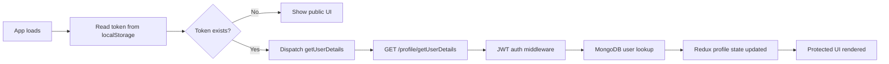
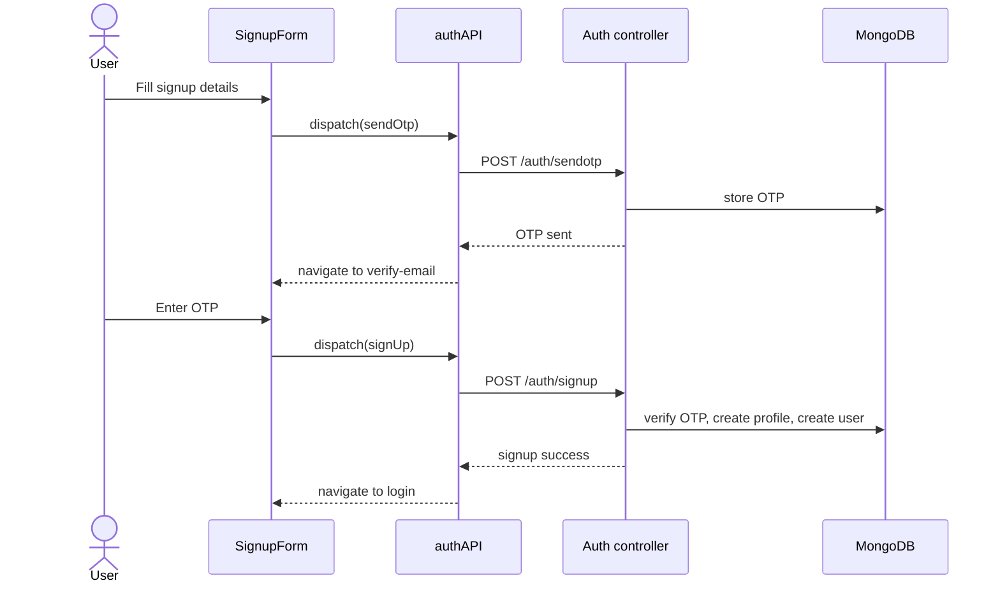
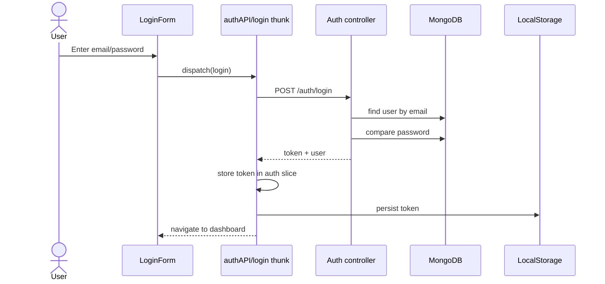
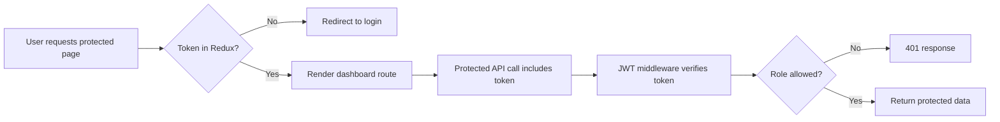
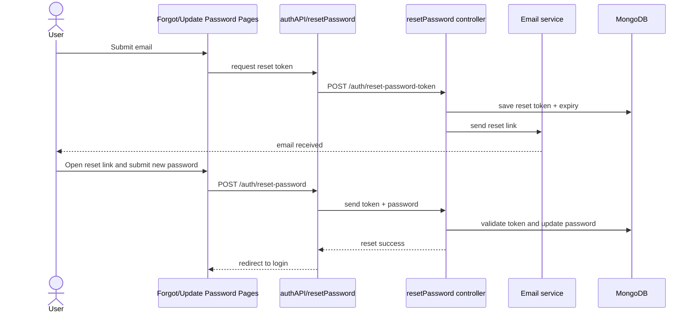
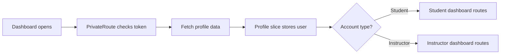
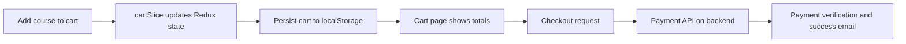

# EduNest / StudyNotion Project Overview

This repository is a full-stack MERN edtech platform. The frontend is a React single-page app, the backend is an Express API, MongoDB stores the data, and the app uses Redux for client-side state management.

The project is organized around a few major capabilities:

- Public marketing pages such as home, about, contact, catalog, and course detail pages.
- Authentication and account management for login, signup, OTP verification, and password reset.
- Role-based dashboards for students and instructors.
- Course browsing, enrollment, course progress, and lecture viewing.
- Cart and payment flow for purchasing courses.
- Profile and settings management for updating user details and password.

## High-Level Architecture

The app has three main layers:

1. **React frontend** - screens, forms, route guards, and user interactions.
2. **Redux state** - stores auth state, user profile, cart, course data, and view-course state.
3. **Express backend** - API routes, controllers, middleware, and MongoDB models.

The frontend talks to the backend through a small axios wrapper. Most features follow the same pattern:

- the user interacts with a React component,
- the component dispatches a Redux thunk or calls an async service function,
- the service sends an HTTP request to the backend,
- the backend reads or writes MongoDB data,
- the response updates Redux state and the UI.

## Main Project Parts

### Frontend entry points

- [src/index.js](src/index.js) mounts the app, Redux provider, router, and toast notifications.
- [src/App.jsx](src/App.jsx) defines the route tree and performs the initial user lookup if a token already exists.

### State management

- [src/slices/authSlice.js](src/slices/authSlice.js) stores the auth token, signup data, and loading state.
- [src/slices/profileSlice.js](src/slices/profileSlice.js) stores the current user profile and loading state.
- [src/slices/cartSlice.js](src/slices/cartSlice.js) stores cart contents, total price, and item count.
- Other slices handle course data and view-course playback state.

### UI and route structure

- Public pages include home, about, contact, catalog, and course details.
- Auth pages include login, signup, verify email, forgot password, and update password.
- Protected dashboard pages are only available to authenticated users.
- Some dashboard routes are role-based, so instructors and students see different sections.

### Backend structure

- [server/index.js](server/index.js) boots Express, connects the database, configures middleware, and registers routes.
- [server/routes/user.js](server/routes/user.js) handles auth-related endpoints.
- [server/controllers/Auth.js](server/controllers/Auth.js) implements signup, login, OTP generation, and password changes.
- [server/controllers/resetPassword.js](server/controllers/resetPassword.js) handles forgot-password and reset-password flows.
- [server/middleware/auth.js](server/middleware/auth.js) validates JWT tokens and enforces role-based access.
- MongoDB models hold users, profiles, OTPs, courses, sections, subsections, reviews, and progress.

## Authentication Model

This project does **not** use OAuth.

There is no Google login redirect, no OAuth callback route, and no provider exchange flow. The auth system is based on:

- email/password login,
- OTP verification during signup,
- JWT tokens for session authentication,
- an httpOnly cookie on the backend,
- a token saved in `localStorage` on the frontend.

The Google icon in the auth UI is only visual. It is not wired to a social login provider.

## Data Flow by Feature

## 1. App Start and Session Restore

When the app loads:

1. The React app starts from [src/index.js](src/index.js).
2. [src/App.jsx](src/App.jsx) checks `localStorage` for a saved token.
3. If a token exists, the app dispatches `getUserDetails(token, navigate)`.
4. The profile API sends the token in the `Authorization` header.
5. The backend verifies the JWT in [server/middleware/auth.js](server/middleware/auth.js).
6. The backend returns the current user profile.
7. Redux stores the user in the profile slice.
8. The UI uses that state to decide what routes and buttons to show.

## 2. Signup Flow

Signup is a two-step flow:

1. The user fills the signup form in [src/components/core/Auth/SignupForm.jsx](src/components/core/Auth/SignupForm.jsx).
2. The frontend validates password rules and matching passwords.
3. The form dispatches `sendOtp(email, navigate)`.
4. The backend generates a 6-digit OTP and stores it in MongoDB.
5. The app navigates to the verify-email page.
6. The user enters the OTP.
7. The frontend dispatches `signUp(...)` with the original signup data plus OTP.
8. The backend verifies the OTP, hashes the password, creates the profile, and creates the user.
9. The user is redirected to the login page.

## 3. Login Flow

Login is a standard email/password flow with JWT issuance:

1. The user submits the login form.
2. The frontend dispatches `login(email, password, navigate)`.
3. The backend finds the user by email.
4. The backend compares the password with bcrypt.
5. If valid, the backend signs a JWT.
6. The backend returns the token and user object, and also sets a cookie.
7. The frontend stores the token in Redux and `localStorage`.
8. The app redirects to the dashboard profile page.

## 4. Protected Route Flow

Protected UI routes are guarded on the frontend, and protected API routes are guarded on the backend.

Frontend route gating:

- [src/components/core/Auth/OpenRoute.jsx](src/components/core/Auth/OpenRoute.jsx) blocks authenticated users from login/signup pages.
- [src/components/core/Auth/PrivateRoute.jsx](src/components/core/Auth/PrivateRoute.jsx) blocks unauthenticated users from dashboard pages.

Backend route gating:

- [server/middleware/auth.js](server/middleware/auth.js) extracts the token from cookies, request body, or the Authorization header.
- It verifies the JWT and attaches the decoded payload to `req.user`.
- Role middleware then checks whether the user is a student, instructor, or admin.

## 5. Forgot Password and Reset Password Flow

Password reset is a separate email-link flow:

1. The user enters an email on the forgot-password page.
2. The frontend calls `getPasswordResetToken(email)`.
3. The backend creates a random token, stores it on the user record, sets an expiry, and sends an email with a reset link.
4. The user opens the link and lands on the update-password page.
5. The frontend submits the new password and token.
6. The backend validates the token and expiry, hashes the new password, and updates the user.

## 6. Profile and Dashboard Data Flow

When a logged-in user opens the dashboard:

1. The dashboard route is allowed by `PrivateRoute`.
2. The app already has the token in Redux and `localStorage`.
3. The profile data is fetched from the backend.
4. The backend uses JWT auth to identify the user.
5. Redux stores the user object in the profile slice.
6. Dashboard components read that state to show the correct view.

For instructors, extra dashboard routes appear for course creation and management.
For students, extra dashboard routes appear for enrolled courses and cart.

## 7. Cart and Checkout Flow

The cart is stored in Redux and synced to `localStorage`.

1. A user adds a course to the cart.
2. The cart slice updates the in-memory state.
3. The slice also writes cart data, total price, and item count to `localStorage`.
4. The cart page reads that state back on reload.
5. During checkout, payment requests go to the backend payment routes.
6. The backend validates and completes the payment flow.

## 8. Course Viewing Flow

Course data is loaded from backend course routes and displayed in multiple places:

- the home page course cards,
- the catalog page,
- the course details page,
- the student lecture player,
- the instructor dashboard.

The flow is typically:

1. A page requests course data.
2. The service layer calls the appropriate course endpoint.
3. The backend returns course, section, subsection, rating, and progress data.
4. Redux stores the relevant slice data.
5. The UI renders course cards, details, progress bars, or lecture content.

## How the Pieces Fit Together

The simplest way to think about the app is:

- React handles screens and user input.
- Redux holds app state that many components need.
- Service files turn UI actions into API calls.
- Express controllers implement business logic.
- MongoDB stores the persistent data.
- JWT and route guards control who can access what.

## Summary

This project is a full-stack learning platform with:

- token-based authentication,
- OTP signup verification,
- password reset by email link,
- role-based dashboards,
- course browsing and viewing,
- cart and payment support,
- persistent state through Redux and localStorage.

The important takeaway is that the project is not using OAuth. Its data flow is built around React -> Redux thunk/service -> Express API -> MongoDB, with JWT used for authenticated requests.