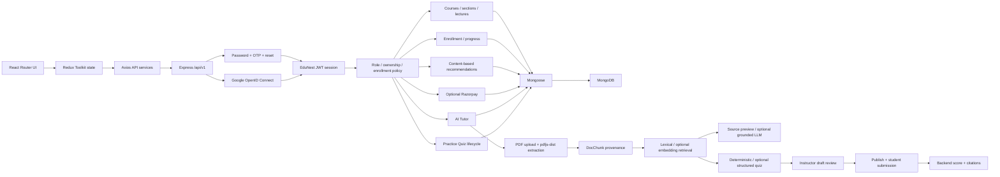

# EduNest AI Project Overview

EduNest AI combines identity, course commerce and delivery, progress tracking, grounded document retrieval, tutoring, and practice assessment in one MERN application. React and Redux provide the browser experience; Express owns product and security decisions; Mongoose persists application data in MongoDB.

## System boundaries

| Boundary | Responsibility |
|---|---|
| React application | Navigation, forms, role-aware views, course consumption, recommendations, Tutor and quiz interaction |
| Redux state | Authentication marker, profile, cart, course content, and lecture-progress state |
| Express API | Identity workflows, JWT sessions, authorization, course operations, recommendation ranking, payment orchestration, ingestion, retrieval, generation, and scoring |
| Mongoose models | Users, profiles, OTPs, courses, sections, lectures, progress, source chunks, and practice quizzes |
| Optional providers | Google identity, OpenAI generation/embeddings, Razorpay payments, Cloudinary media, and email delivery |

## Runtime architecture

## Frontend composition

`src/App.jsx` defines public, open-auth, protected dashboard, course, and Google callback routes. `PrivateRoute` and `OpenRoute` provide navigation behavior, while backend middleware remains authoritative.

The authentication slice stores signup data, loading state, and either the application bearer JWT used by email/password sessions or a non-secret cookie-session marker used after Google login. The profile slice holds the populated user. Axios sends credentials on every API request so HttpOnly sessions work across the local frontend and API ports.

Service modules organize calls by identity, profile, courses, recommendations, payments, Tutor, and Practice Quiz. The enrolled-courses dashboard adds responsive recommendation cards with loading, error, empty, personalized, and new-student states. Course AI screens use the same authenticated course ID for retrieval and quiz operations.

## Backend composition

- `server/index.js` loads configuration, applies exact-origin credentialed CORS, JSON/cookie/file middleware, and route groups.
- `server/controllers/Auth.js` handles OTP-backed registration, password login, and password changes.
- `server/controllers/googleAuth.js` handles Google OpenID Connect initiation, callback validation, safe persistence, and session issuance.
- `server/middleware/auth.js` verifies the EduNest JWT, then role middleware resolves the current user from MongoDB.
- Course, section, lecture, payment, progress, profile, recommendation, Tutor, and quiz controllers own their domain behavior.
- `server/services/courseRecommendationService.js` owns transparent lexical vector construction, ranking, explanations, and database assembly; its weights are exported in one configuration block.
- `server/ai/` contains PDF parsing, lexical retrieval, embedding and LLM adapters, and deterministic quiz logic.

## Identity workflows

### Email/password registration

1. The signup screen collects name, email, password, and Student or Instructor account type.
2. `POST /auth/sendotp` checks that the email is unused and creates an expiring OTP record.
3. The verification screen sends the OTP and pending signup data to `POST /auth/signup`.
4. The API validates the most recent OTP, hashes the password, creates a Profile and User, and records the email as verified.
5. The user signs in through the password flow.

Admin creation is not exposed through Google login. Google creation always assigns Student.

### Email/password login and restore

1. `POST /auth/login` normalizes the email, loads the password hash explicitly, and verifies it with bcrypt.
2. The API creates a 24-hour EduNest JWT containing user ID, email, and account type.
3. The token is returned for the established bearer-token client contract and also set as an HttpOnly cookie.
4. Redux stores the token and populated profile; reload uses `GET /profile/getUserDetails` to restore the user.
5. Protected API calls send the bearer token. Middleware also accepts the HttpOnly cookie.

### Google OpenID Connect login

1. The UI checks `/auth/google/status`. Missing or invalid credentials yield a disabled button without server failure.
2. `/auth/google` discovers Google metadata lazily, generates state, nonce, and PKCE values, stores them in temporary HttpOnly cookies, and redirects to Google.
3. Google authenticates the user and returns an authorization code to the exact configured backend callback.
4. The callback clears temporary cookies, validates the state, and exchanges the code using the backend-only client secret and PKCE verifier.
5. `openid-client` verifies the ID-token signature and issuer metadata, audience, expiration, and nonce.
6. EduNest requires `email_verified=true` and a subject claim. A matching provider subject logs in. A new verified email creates a Student profile. An existing unlinked email returns an account conflict.
7. Google access and ID tokens remain transient. The backend creates an EduNest JWT in an HttpOnly cookie and redirects to the React callback without any token in the URL.
8. The callback page calls the normal authenticated profile endpoint, fills Redux state, and enters the standard dashboard.

### Password recovery and logout

Local accounts can request a time-bounded reset link and replace the stored password hash. Google-only accounts receive a clear instruction to continue with Google. Logout calls `/auth/logout`, clears the HttpOnly cookie, removes browser authentication state, resets profile/cart state, and returns home.

## Course lifecycle

Instructors create course metadata, organize sections, add lecture subsections, publish courses, and manage their catalog. Students browse published offerings and enroll. When Razorpay is configured, capture and verification endpoints complete paid enrollment; course access is updated only after backend verification. Lecture completion writes course-progress state, which feeds enrolled-course progress and dashboards.

Role middleware limits authoring to instructors and administrative category operations to admins. Course controllers and AI controllers add record-level ownership and enrollment checks.

## Course recommendation data flow

1. `GET /api/v1/recommendations/courses?limit=6` passes the standard JWT middleware.
2. The service loads the caller's enrolled courses, published unseen courses, aggregate reviews/enrollment counts, and progress records.
3. Title (3.0), category (2.5), tags (2.0), description (1.0), learning outcomes (0.75), and instructions (0.5) contribute weighted term frequencies. Corpus IDF is `log((N + 1) / (df + 1)) + 1`.
4. Enrolled vectors form an average interest profile. Reliable progress adds at most a 0.35 multiplier to an enrolled course; empty course structures never receive an artificial boost.
5. Personalized score is `0.93 × cosine(profile, candidate) + 0.04 × normalized rating + 0.02 × normalized log popularity + 0.01 × relative recency`.
6. With no enrollments, cold-start score is `0.65 × normalized rating + 0.25 × normalized log popularity + 0.10 × relative recency`.
7. The service excludes enrolled IDs, applies a maximum limit of 12, breaks exact ties by course title then ID, and returns a reason from the matched category/tag or the actual fallback signal.

This is content-based lexical ranking, not collaborative filtering or a trained model. Reviews, enrollment count, and creation date cannot outweigh meaningful content similarity in personalized mode.

## AI Tutor data flow

1. An authenticated instructor uploads a PDF for a course they own.
2. The API validates the file and prevents duplicate course documents using a SHA-256 content hash.
3. `pdfjs-dist` extracts text per page. Deterministic page-aware chunking retains document ID, document name, page number, course ID, content hash, and chunk text.
4. `DocChunk` records persist in MongoDB. Optional embeddings are generated only when OpenAI is configured.
5. A Tutor question passes ownership/enrollment authorization before retrieval.
6. Retrieval uses local lexical scoring or cosine similarity when compatible embeddings exist.
7. Weak or unrelated evidence returns `insufficient_evidence`. Without an OpenAI key, supported evidence returns a source preview. With a key, the LLM receives only retrieved excerpts and must produce a grounded response.
8. The API returns document/page citations derived from stored provenance, not browser-supplied metadata.

Course ID is included in every chunk query, preventing retrieval across courses.

## Practice Quiz data flow

1. A course owner requests a quiz with a topic, count, and question types.
2. The API retrieves course-scoped evidence.
3. No-key mode deterministically extracts supported factual short-answer questions. Optional OpenAI mode requests structured JSON and validates answers and source chunk IDs against retrieved evidence.
4. A `PracticeQuiz` is stored as a draft. The instructor can edit questions, remove draft questions, save, and publish.
5. Enrolled students receive only published quiz fields; correct answers and explanations are omitted.
6. The student submits answers keyed by question ID.
7. The backend scores each answer and returns aggregate score plus per-question correctness, expected answer, explanation, and citations.

Quiz lookups bind course and quiz identifiers, enforcing cross-course isolation. Draft mutations require ownership, and student reads/submissions require enrollment.

## Data model highlights

- `User`: verified email, local or Google provider, optional provider subject, role, profile, courses, progress, password/reset fields for local identity
- `Profile`: contact and learner/instructor profile details
- `OTP`: email verification values with expiration
- `Course`, `Section`, `SubSection`: course hierarchy and lecture content
- `CourseProgress`: completed lecture references per user and course
- `DocChunk`: course/document/page provenance, text, hash, and optional embedding
- `PracticeQuiz`: course owner, evidence-backed questions, draft/published status, and timestamps
- Recommendation ranking adds no new model; it derives a request-time profile from `User.courses`, `Course`, `Category`, `CourseProgress`, and aggregate `RatingAndReview` data.

Provider access tokens and refresh tokens are not persisted.

## Failure and fallback behavior

- Missing Google settings: status reports disabled; local authentication and demo startup continue.
- Partial or invalid Google settings: button remains disabled and no provider discovery occurs at startup.
- Expired or mismatched OAuth state/nonce/PKCE: callback fails and clears temporary state.
- Existing unlinked email: explicit conflict; no automatic linking.
- Missing OpenAI key or provider failure: lexical retrieval, source preview, and deterministic quiz generation remain available.
- Weak evidence: Tutor abstains and quiz generation reports insufficient support.
- No enrollment history: recommendations fall back to deterministic aggregate catalog ranking instead of returning an empty section.
- Missing or malformed course metadata: safe normalization yields empty tokens and preserves deterministic fallback ordering.
- Missing Razorpay configuration: paid checkout is unavailable, but course and AI workflows continue.

## Local verification

`npm run demo` launches React, Express, and seeded in-memory MongoDB with no external AI or identity credentials. `node server/recommendationTest.js` validates deterministic ranking boundaries, and `node server/authRegressionTest.js` validates provider-independent authentication behavior. `server/e2eTest.js` verifies personalized/cold-start recommendations, password login, ownership/enrollment isolation, PDF ingestion, Tutor citations/abstention, and Practice Quiz scoring against the demo API. The React production build validates frontend compilation and route integration.
