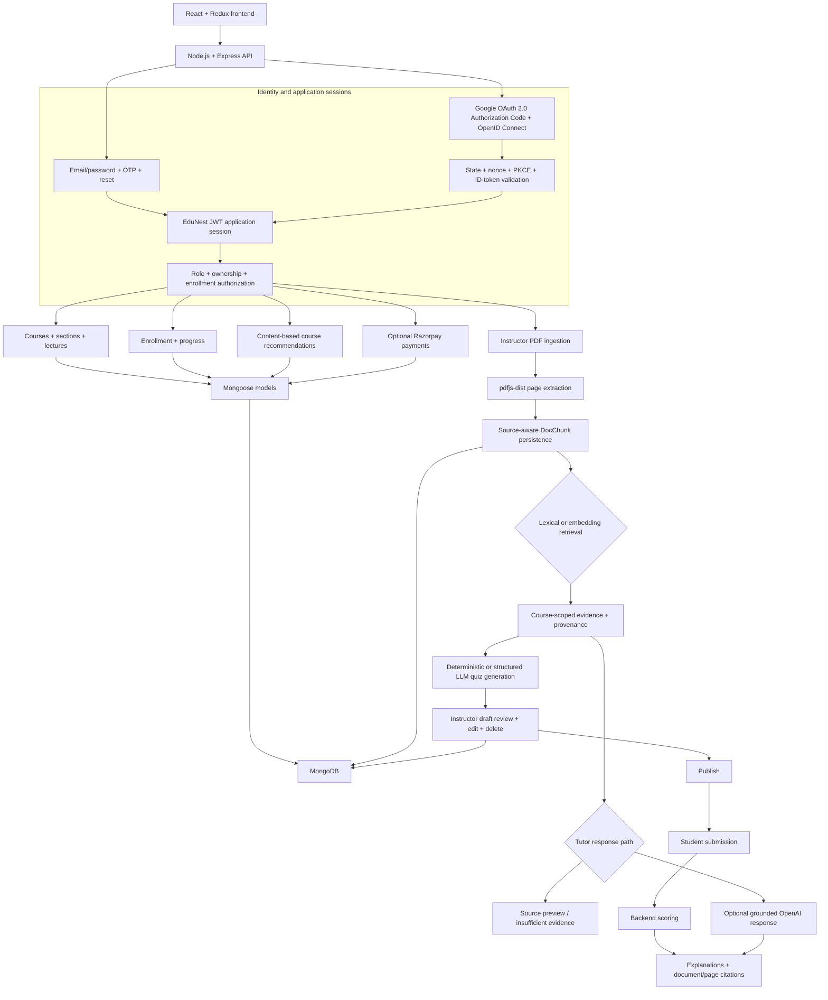

# EduNest AI

EduNest AI is a full-stack learning platform for course delivery, learner progress, payments, course-grounded tutoring, and evidence-backed practice assessment. Students, instructors, and administrators use one React application backed by an Express API and MongoDB.

The platform supports email/password identity with OTP verification and password recovery, Google login through OpenID Connect, JWT application sessions, course authoring and enrollment, optional Razorpay checkout, deterministic content-based course recommendations, PDF-grounded AI Tutor responses, and an instructor-reviewed Practice Quiz lifecycle.

## Product capabilities

### Identity and access

- Email/password registration for Student and Instructor accounts
- Email OTP verification before account creation
- Email-driven password reset and authenticated password changes
- Google login using the OAuth 2.0 Authorization Code flow with OpenID Connect, state, nonce, and PKCE
- EduNest JWT application sessions for both sign-in methods
- Student, Instructor, and Admin roles with role-aware navigation and dashboards
- Server-enforced role, course-ownership, enrollment, and cross-course authorization
- Logout that clears browser and server-managed application-session state

Google sign-in never creates an Instructor or Admin. A new verified Google identity becomes a Student. If its verified email already belongs to an unlinked EduNest account, login stops with a conflict instead of linking accounts automatically.

### Courses and learning

- Instructor course creation, editing, publication, and deletion
- Course sections and lecture content
- Student discovery and enrollment
- Razorpay payment capture and verification when credentials are configured
- Lecture-completion and course-progress tracking
- Student enrolled-course views and instructor course analytics
- Profile and settings workflows shared across authenticated roles

### Course-grounded AI Tutor

- Instructor-only PDF upload with file-size and parser validation
- Page-aware extraction with `pdfjs-dist`
- Source-aware `DocChunk` persistence containing course, document, page, and text provenance
- SHA-256 duplicate-document prevention within each course
- Deterministic lexical retrieval without an external AI key
- Optional OpenAI embedding generation and cosine-similarity retrieval
- Optional grounded OpenAI answers constrained to retrieved evidence
- Document and page citations in supported answers
- Explicit insufficient-evidence responses when course material cannot support a claim
- Course ownership, enrollment, and course-ID isolation before document access

### Course recommendations

- Protected `GET /api/v1/recommendations/courses?limit=6` student-facing endpoint
- Weighted TF-IDF-style vectors from course title, description, category, tags, learning outcomes, and instructions
- A student-interest profile built from enrolled-course vectors, with a bounded progress boost only when lesson count and completion data are reliable
- Cosine similarity as 93% of personalized score; rating, real enrollment count, and relative recency are bounded tie-breakers
- Deterministic cold-start ranking from rating, popularity, and relative recency
- Already-enrolled courses excluded and stable title/ID ordering for exact ties
- Explanations derived from matched category/tag or actual fallback signals; no LLM-generated reasons

### Practice Quizzes

- Instructor-only generation from retrieved course evidence
- Deterministic no-key short-answer generation
- Optional structured LLM generation for short-answer and multiple-choice questions
- Evidence validation for generated answers and source chunk references
- Draft review, question editing, deletion, saving, and publication
- Published-only access for enrolled students
- Student-safe payloads that hide answers before submission
- Question-ID-keyed submission and backend scoring
- Per-question explanations, correct answers, and document/page citations after scoring

## Technology stack

| Layer | Technology |
|---|---|
| Web client | React 18, Redux Toolkit, React Router, Tailwind CSS, Axios |
| API | Node.js, Express, JWT middleware, `cookie-parser`, `express-fileupload` |
| Identity | bcrypt, OTP email verification, OpenID Connect with `openid-client` |
| Data | MongoDB, Mongoose, `mongodb-memory-server` for the local demo |
| Course media | Cloudinary when configured |
| Documents | `pdfjs-dist`, SHA-256 hashing, page-aware chunks |
| Retrieval and ranking | Local TF-IDF-style lexical retrieval and content-based recommendations; optional OpenAI Tutor embeddings |
| Generation | Deterministic quiz generation; optional grounded OpenAI chat completions |
| Payments | Optional Razorpay integration |

## Architecture



Optional embeddings are stored directly on MongoDB chunk records alongside their source provenance.

## Authentication design

### Email/password

Registration sends an OTP, validates it on the API, hashes the password with bcrypt, and creates the requested Student or Instructor account. Login verifies the password and issues a 24-hour EduNest JWT. The API accepts that JWT through the existing bearer-token contract and an HttpOnly session cookie. Password reset uses a time-limited emailed token.

### Google OpenID Connect

1. The frontend reads `GET /api/v1/auth/google/status`; the button is disabled when credentials are absent.
2. `GET /api/v1/auth/google` creates cryptographically random state, nonce, and PKCE verifier values in temporary HttpOnly cookies.
3. The backend redirects to Google's authorization endpoint with `response_type=code`, `scope=openid email profile`, state, nonce, and an S256 PKCE challenge.
4. Google returns to the exact configured backend redirect URI.
5. The backend compares state, exchanges the one-time code using the server-side client secret and PKCE verifier, and validates the ID token through discovered Google metadata and signing keys. The client library validates issuer, audience, signature, expiry, and nonce.
6. EduNest accepts only a verified email. A linked Google subject logs in; a new email creates a Student; an existing unlinked email returns a conflict.
7. The backend issues its own JWT in an HttpOnly cookie and redirects to `/auth/google/callback`. The React page restores Redux profile state through the normal authenticated API. Google tokens are neither persisted nor used for EduNest API authorization.
8. Temporary OAuth cookies are cleared on callback success and failure. Production cookies use `Secure`, `HttpOnly`, `SameSite=Lax`, bounded expiration, and `__Host-` names for temporary values.

No authorization code, Google token, client secret, password, or EduNest JWT is logged or placed in the post-login redirect URL.

## Authorization boundary

Frontend route guards control navigation; Express middleware and course-scoped database checks are the security boundary.

- Instructors can modify only their own courses and course documents.
- Tutor queries require course ownership or enrollment.
- Quiz draft generation, editing, deletion, and publication require course ownership.
- Students can read and submit only published quizzes for courses in which they are enrolled.
- Quiz queries bind both `courseId` and `quizId` to prevent cross-course identifier substitution.
- Student-facing draft responses omit correct answers and explanations until backend scoring completes.
- Course recommendations require an authenticated application session and return only aggregate catalog signals, never another user's private data.

## One-command local demo

### Prerequisites

- Node.js 22.18 or another compatible Node 22 release (`>=22.13.0 <23`)
- Root and server dependencies installed once

```bash
npm install
cd server
npm install
cd ..
```

Start the complete local product:

```bash
npm run demo
```

- Frontend: `http://localhost:3000`
- API: `http://localhost:4000/api/v1`
- Sample PDF: `sample/edunest_sample.pdf`

The command starts React, Express, an ephemeral in-memory MongoDB instance, five development-only identities, an eight-course catalog across four categories, and a generated sample PDF. Email/password, recommendations, Tutor, and Practice Quiz paths work without Google, OpenAI, Razorpay, Cloudinary, or a local MongoDB installation.

All demo users use password `Demo123!`.

| Role | Email | Seeded access |
|---|---|---|
| Instructor | `instructor@edunest.demo` | Owns the seeded catalog |
| Enrolled Student | `student@edunest.demo` | Main-course history and personalized recommendations |
| New Student | `outsider@edunest.demo` | Cold-start recommendations and enrollment-denial checks |

See [docs/DEMO_GUIDE.md](docs/DEMO_GUIDE.md) for the end-to-end walkthrough.

## Standard local configuration

Copy `.env.example` to `server/.env`. Keep a root `.env` only when overriding the React API base URL.

Required backend values:

```dotenv
MONGODB_URL=mongodb://127.0.0.1:27017/edunest
JWT_SECRET=replace-with-a-local-development-secret
PORT=4000
CLIENT_URL=http://localhost:3000
```

For Google login, create a Google **Web application** OAuth client and add this exact Authorized redirect URI:

```text
http://localhost:4000/api/v1/auth/google/callback
```

Then set only in `server/.env`:

```dotenv
GOOGLE_CLIENT_ID=your-client-id.apps.googleusercontent.com
GOOGLE_CLIENT_SECRET=your-client-secret
GOOGLE_REDIRECT_URI=http://localhost:4000/api/v1/auth/google/callback
```

The client secret must never use a `REACT_APP_` variable. Google login remains disabled when these three values are blank, and every other authentication path continues to operate.

Start persistent-database development with `npm run server` and `npm start` in separate terminals.

## Optional providers

- `OPENAI_API_KEY`: enables embeddings, grounded Tutor generation, and structured quiz generation. Without it, lexical retrieval, source previews, abstention, and deterministic quiz generation remain available.
- `RAZORPAY_KEY` and `RAZORPAY_SECRET`: enable paid enrollment.
- Cloudinary values: enable managed course media upload.
- Mail values: enable OTP, password-reset, and notification delivery.

Provider credentials are server-only and must not be committed.

## Verification commands

```bash
node server/authRegressionTest.js
node server/recommendationTest.js
npm run build
cd server
npm run demo:verify
```

The provider-independent authentication test validates disabled configuration, redirect validation, user-model rules, JWT claims, and cookie policies. The recommendation test covers exclusion, lexical ranking, cold start, limit enforcement, malformed metadata, and unauthenticated rejection. `demo:verify` exercises both recommendation profiles plus email/password login, authorization, PDF ingestion, Tutor citations/abstention, and the Practice Quiz lifecycle against the running demo.

## Current constraints

- Demo data is ephemeral.
- Quiz attempts and historical scores are not persisted.
- No-key quiz generation supports a bounded set of factual short-answer patterns.
- Retrieval quality has not been benchmarked.
- Recommendation quality has no offline relevance benchmark or behavioral-feedback loop; lexical matching cannot infer every semantic relationship.
- Live OpenAI, Razorpay, email, Cloudinary, and Google authentication require developer-owned credentials.
- PDF acceptance uses MIME type or filename plus successful parsing; it does not independently inspect the file signature.

## Documentation

- [Project overview](PROJECT_OVERVIEW.md)
- [Azure production deployment](docs/AZURE_DEPLOYMENT.md)
- [Demo guide](docs/DEMO_GUIDE.md)
- [Interview guide](docs/INTERVIEW_GUIDE.md)
- [Resume evidence](docs/RESUME_METRICS.md)
- [Build status](docs/BUILD_STATUS.md)
