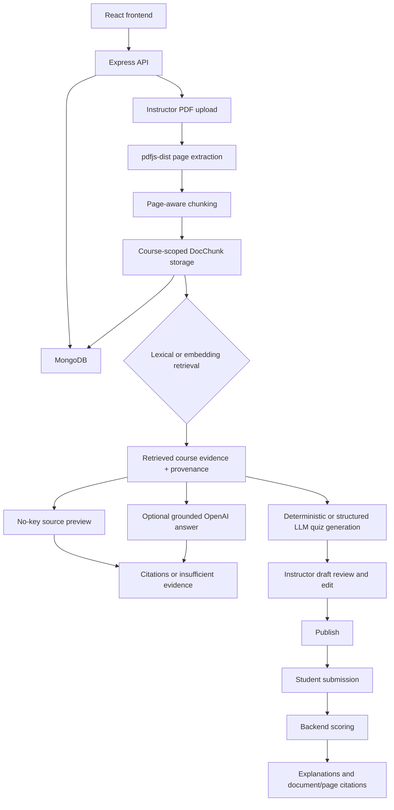

# EduNest AI

EduNest AI is a portfolio-focused extension of an existing MERN learning-management foundation. It adds a course-grounded AI Tutor and an evidence-backed Practice Quiz workflow to the LMS's existing authentication, course, enrollment, dashboard, progress, cart, and payment features.

The original LMS foundation was not built entirely from scratch for this project. The work highlighted here is the AI learning layer: PDF ingestion, retrieval, grounded responses, citations, authorization, quiz generation, instructor review, publishing, student submission, and backend scoring.

## The problem

Generic chatbots can answer outside a course's curriculum, omit provenance, and expose the wrong material if authorization is handled only in the UI. EduNest AI keeps retrieval scoped to one course, checks instructor ownership or student enrollment on the server, and returns either cited course evidence or an explicit insufficient-evidence response.

It also turns the same retrieved evidence into reviewable practice quizzes. Generated questions remain drafts until an instructor edits and publishes them, and correct answers stay hidden from students until backend scoring is complete.

## Project highlights

### AI Tutor

- Instructor-owned PDF upload with PDF and size validation.
- Page-aware text extraction with `pdfjs-dist`.
- Deterministic 1,200-character page chunking with document and page provenance.
- Course-scoped `DocChunk` storage in MongoDB.
- SHA-256 duplicate-document prevention per course.
- Same-name document replacement when the content hash changes.
- Local TF-IDF-style lexical retrieval with no external AI dependency.
- Optional OpenAI embeddings stored on chunks and cosine-similarity retrieval.
- Optional grounded OpenAI answers using only retrieved excerpts.
- Document-name and page-number citations.
- Explicit `insufficient_evidence` behavior for missing or weakly supported evidence.
- Source-preview fallback when no OpenAI key is configured or an LLM request fails.

### Practice Quiz

- Course-evidence retrieval before generation.
- Deterministic no-key generation of factual short-answer questions.
- Optional structured OpenAI generation for short-answer and multiple-choice questions.
- Validation that generated answers and source chunk IDs are supported by retrieved course evidence.
- Instructor-only draft generation, editing, deletion of draft questions, saving, and publishing.
- Published-only access for enrolled students.
- Student-safe quiz responses that omit correct answers before submission.
- Backend scoring for question-ID-keyed submissions.
- Per-question submitted answer, correct answer, correct/incorrect status, explanation, and citations after submission.
- Controlled frontend answer state, incomplete-submission prevention, duplicate-submit protection, and clean retry/reopen behavior.

## Technology stack

| Layer | Technology |
|---|---|
| Frontend | React 18, Redux Toolkit, React Router, Tailwind CSS, Axios |
| API | Node.js, Express, JWT middleware, `express-fileupload` |
| Data | MongoDB and Mongoose; `mongodb-memory-server` for the demo |
| Documents | `pdfjs-dist`, `pdfkit`, SHA-256 hashing |
| Retrieval | Local tokenization and TF-IDF-style lexical scoring; optional OpenAI embeddings and cosine similarity |
| Generation | Deterministic local quiz extraction; optional OpenAI chat completions |
| Verification | One-command seeded demo, backend verification script, React production build |

## Architecture



There is no Redis, FastAPI service, vector database, queue, or microservice layer in the current implementation. Embedding arrays, when enabled, are stored directly in MongoDB documents.

## Authorization model

Every AI route requires a verified JWT. The backend then applies course-specific checks:

- Only the course's instructor can upload documents, generate quizzes, edit drafts, or publish quizzes.
- The instructor and enrolled students can query the course tutor.
- Enrolled students can list and open only published quizzes.
- Draft correct answers and explanations are removed from student-facing responses.
- Quiz lookup includes both `courseId` and `quizId`, preventing cross-course quiz access by changing a URL identifier.
- Non-enrolled users receive a `403` response.

Frontend route guards support navigation, but backend ownership and enrollment checks are the security boundary.

## One-command local demo

The demo needs no MongoDB installation and no OpenAI key. It starts an in-memory MongoDB instance, seeds users and two isolated courses, creates a valid sample PDF, and starts both application processes.

### Prerequisites

- Node.js and npm
- Root and server dependencies installed once

```bash
npm install
cd server
npm install
cd ..
```

### Start

```bash
npm run demo
```

- Frontend: `http://localhost:3000`
- Backend API: `http://localhost:4000/api/v1`
- Sample PDF: `sample/edunest_sample.pdf`

The terminal prints the generated demo course IDs each time because the database is recreated for every run.

### Demo credentials

All demo accounts use password `Demo123!`.

| Role | Email | Access |
|---|---|---|
| Instructor | `instructor@edunest.demo` | Owns both seeded courses |
| Enrolled student | `student@edunest.demo` | Enrolled in the main demo course |
| Outsider | `outsider@edunest.demo` | Not enrolled in either course |

## Suggested demo walkthrough

1. Start `npm run demo` and copy the printed **EduNest AI Demo Course ID**.
2. Sign in as the instructor and open `/courses/<COURSE_ID>/ai`.
3. Upload `sample/edunest_sample.pdf`.
4. Ask `When was EduNest AI launched?` and show the no-key source preview with its page citation.
5. Ask `What is the capital of France?` and show the insufficient-evidence response.
6. Generate a three-question Practice Quiz, review/edit the draft, save it, and publish it.
7. Sign in as the enrolled student, reopen the same course AI page, answer all three questions, and submit.
8. Show the score plus per-question answers, explanations, and citations.
9. Use **Try Again** or **Back to Quizzes** to demonstrate clean state reset.
10. Sign in as the outsider and show that course quiz access is blocked.

See [docs/DEMO_GUIDE.md](docs/DEMO_GUIDE.md) for the detailed script.

## Optional OpenAI mode

The local demo works without external services. To exercise the optional provider path, create `server/.env` from `.env.example` and set:

```dotenv
OPENAI_API_KEY=your-key
EMBEDDING_MODEL=text-embedding-3-small
LLM_MODEL=gpt-4o-mini
```

Restart the demo after changing environment variables, then upload the PDF again so ingestion can create embeddings. With a configured key:

- document chunks request embeddings;
- retrieval prefers cosine similarity when compatible embeddings exist;
- supported tutor questions request a grounded LLM answer;
- quiz generation requests strict structured JSON and validates it against retrieved evidence;
- provider failures fall back to source preview, or to deterministic short-answer quiz generation when compatible with the requested question types.

Do not commit `server/.env` or real provider credentials.

## Standard local development

For development with a persistent MongoDB database:

1. Copy `.env.example` to `server/.env` and configure `MONGODB_URL`, `JWT_SECRET`, and any LMS providers you intend to use.
2. Leave `REACT_APP_BASE_URL` at `http://localhost:4000/api/v1`, or place it in a root `.env` if the API runs elsewhere.
3. Start the backend from the repository root:

   ```bash
   npm run server
   ```

4. In another terminal, start the frontend:

   ```bash
   npm start
   ```

5. Build the frontend with:

   ```bash
   npm run build
   ```

## Limitations

- The demo database is ephemeral and resets when the process stops.
- Lexical retrieval is a compact in-process TF-IDF-style implementation, not BM25 or a measured production search system.
- Embeddings and LLM behavior require a valid OpenAI key and were not part of the deterministic no-key verification.
- The no-key quiz generator recognizes a small set of factual sentence patterns and produces short-answer questions only.
- Quiz attempts and historical scores are not persisted; scoring is returned for the current submission.
- The frontend prevents incomplete submissions, while unanswered backend payload entries are currently scored as incorrect rather than rejected.
- PDF validation uses the upload MIME type or filename extension plus parser success; it does not independently inspect a file signature.
- Existing LMS areas retain technical debt and production-build warnings inherited from the foundation.
- This is a local portfolio project, not a production deployment blueprint.

## Future improvements

- Add focused automated tests for ingestion, authorization, quiz validation, and frontend state transitions.
- Persist student attempts and provide a simple attempt history.
- Add stronger PDF signature validation and clearer document-version management.
- Add a small labelled retrieval fixture before making retrieval-quality claims.
- Improve the deterministic generator's supported sentence patterns and multiple-choice fallback.
- Reduce inherited frontend lint warnings and bundle size.

## Portfolio notes

- [Demo guide](docs/DEMO_GUIDE.md)
- [Interview guide](docs/INTERVIEW_GUIDE.md)
- [Resume evidence and draft bullets](docs/RESUME_METRICS.md)
- [Existing LMS overview](PROJECT_OVERVIEW.md)
